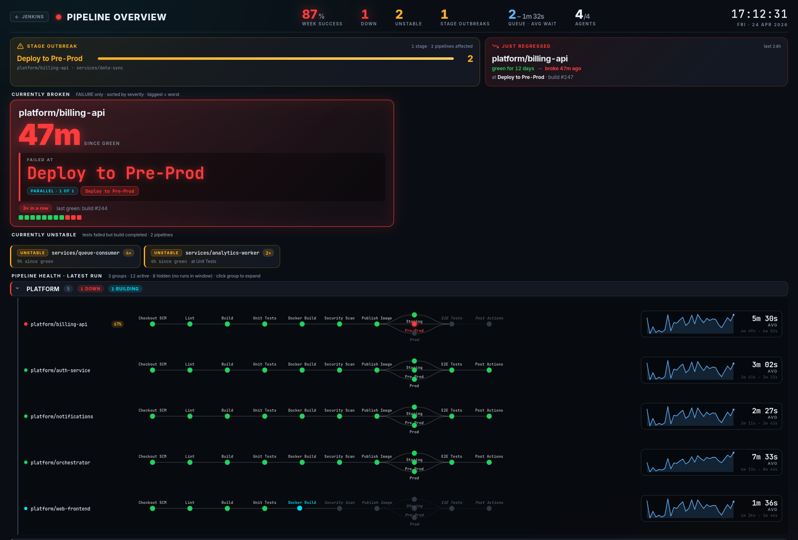

# Holistic

Jenkins dashboard for a TV in the office. shows what's broken, where, and for how long. designed to be read from across the room.



## what it does

top strip is the at-a-glance state of your CI: weekly success rate, how many pipelines are currently down, how many are unstable, how many stage outbreaks are happening, build queue + avg wait, agents healthy / total.

below that:

* **stage outbreak** clusters broken pipelines by which stage they failed at. when 5 pipelines all break at "Deploy" or "E2E Tests" it's almost always a shared library or shared infra problem and you want to know fast.
* **just regressed** flags pipelines that were green for at least 6h then broke in the last 24h. the scariest class of failure because something just changed.
* **currently broken** shows pipelines whose latest build failed. fresh regressions (broke in the last 24h after >= 6h green) get the top cards so today's actionable failures don't get buried; the rest follow, longest-broken first.
* **currently unstable** is its own smaller section, separate from broken, since "tests failed but build completed" is a different problem from "the build itself blew up".
* **pipeline health** expands per group, each pipeline rendered like jenkins' native stage view but smaller, with curved bezier connectors and parallel branches fanning out vertically.
* **exec time graph** per pipeline shows the last 30 *successful* build durations as a sparkline + avg + range. trend chip lights up amber if builds are getting consistently slower (↑ %) or green if faster (↓ %).
* **build queue** with a 60-sample sparkline. sustained queue depth is your signal to add agents.
* **lockable resources** pulses amber after 15min held, red after 30min. catches stuck CI environments before someone notices manually.
* **agents** panel at the bottom (k3s + ec2 fleet style).

clicking the "Pipeline Overview" entry in the jenkins sidebar opens the dashboard fullscreen with a tiny back button. bookmark that URL on your TV browser and walk away.

## install

not on the jenkins update site. two ways:

**drop the HPI in.** download `holistic.hpi` from a release (or `mvn package` it yourself), put it in `$JENKINS_HOME/plugins/`, restart jenkins.

**bake it into a docker image.**
```dockerfile
COPY holistic.hpi /usr/share/jenkins/ref/plugins/
```
with `PLUGINS_FORCE_UPGRADE=true` so a newer bundled HPI replaces an older one on the persistent volume.

## config

JCasC. simplest setup, auto-discover everything jenkins knows about:

```yaml
jenkins:
  views:
    - holistic:
        name: "Pipeline Overview"
        autoDiscover: true
```

that's it. groups are inferred from folder name or first dash-prefix of the job name (so `platform-billing-api/main` ends up under "PLATFORM"). PR branches and inactive pipelines get filtered out.

if you want a curated subset instead:

```yaml
jenkins:
  views:
    - holistic:
        name: "Pipeline Overview"
        refreshIntervalSeconds: 30
        historyDays: 30
        groups:
          - name: "Platform"
            pipelines:
              - jobName: "platform/auth-service/main"
              - jobName: "platform/billing-api/main"
          - name: "Services"
            pipelines:
              - jobName: "services/analytics-worker/main"
              - jobName: "services/queue-consumer/main"
          - name: "E2E Tests"
            pipelines:
              - jobName: "scheduled-e2e-staging"
              - jobName: "scheduled-e2e-prod"
```

other knobs:

* `refreshIntervalSeconds`. how often the dashboard re-fetches. default 30, min 5.
* `historyDays`. how far back to look for week stats, exec times, regression detection. default 30, max 90. pipelines with no builds in this window get filtered out as inactive.
* `dashboardTitle`. heading text in the command strip.
* `headerMessage`. optional sub-header text.
* `autoExcludeFolders`. list of folder prefixes auto-discover should skip, e.g. `["sonar", "releases"]` if you want to ignore sonar scan jobs.

## how the metrics are calculated

| metric | how |
|---|---|
| week success % | `successCount / totalCount` of builds finished in the last 7 days, across all configured pipelines. UNSTABLE / FAILURE / ABORTED all count against |
| down | latest finished build's `result == FAILURE` |
| unstable | latest finished build's `result == UNSTABLE` |
| stage outbreaks | broken pipelines clustered by failed stage name; only stages with 2+ pipelines failing count as an outbreak |
| queue / avg wait | live `Jenkins.get().getQueue().getItems()` count + avg time items have been waiting |
| agents | healthy / total **permanent** agents (cloud agents shown separately at the bottom) |
| just regressed | green for >= 6h, broke in the last 24h |
| stage status (per pipeline) | FlowGraph node-level statuses are the source of truth, including aggregation across inner parallel branches that pipeline-rest-api filters out. `RunExt.getStages()` is consulted only to surface `IN_PROGRESS` / `PAUSED_PENDING_INPUT` while a build is mid-flight; if it reports a terminal status on a stage with no actual node activity (the build's overall result getting propagated down to stages that never ran), that's treated as `NOT_EXECUTED` so downstream stages render skipped instead of red |
| exec time graph | last 30 *successful* runs only. failed/aborted would skew the trend |

## live preview

open `docs/preview.html` in a browser. it mocks the data so the dashboard renders without needing a jenkins. useful if you just want to see what the layout looks like before installing.

## building

```
mvn package
```

needs JDK 17+, maven 3.6+. targets jenkins 2.541+. depends on `workflow-api`, `workflow-job`, `pipeline-rest-api`, `ionicons-api`. `lockable-resources` is detected at runtime via reflection so you don't need to install it.

## stuff worth knowing

* multibranch jobs: auto-discover treats `<multibranch>/main` as one entry. branches matching `PR-*` get skipped.
* declarative `parallel { stage(...) }` blocks render as fanned-out branches, same shape as jenkins' native stage view.
* folder-organised jobs (`releases/X`, `sonar/X`) get the top-level folder name as their group.
* the `historyDays` window is doing a lot of work. pipelines with no builds in it get filtered out entirely. so a pipeline that's been broken for 3 months but nobody touches won't show up unless you bump the window.
* if a build is UNSTABLE because a post-build test publisher (junit/jacoco) flagged it, but every individual stage was technically SUCCESS, the dashboard propagates UNSTABLE to the last non-skipped stage so the visual matches the build's overall result.

## license

apache 2.0
